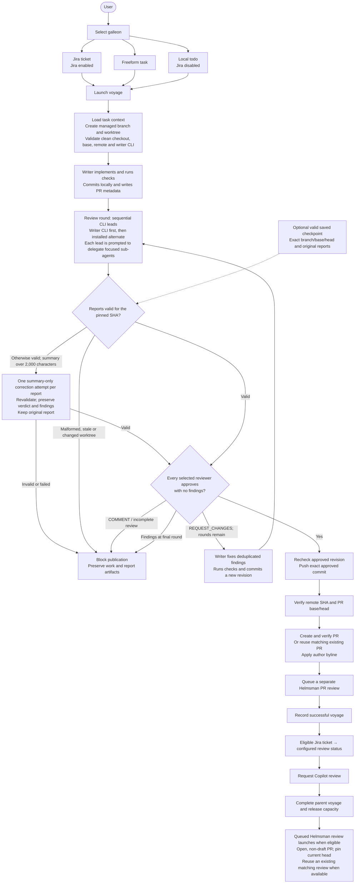

# Helmsman voyage flow

Open [helmsman-process.html](helmsman-process.html) for the standalone diagram. It works offline and can be printed or saved as a PDF from a browser.

## Defaults and boundaries

- **Defaults:** 2 desired reviewer CLIs, 3 review rounds, 45 minutes per agent session. Configuration allows 1–2 reviewers, 1–5 rounds, and 5–180 minutes. These are defaults, not a statement of current live settings.
- The writer CLI is required. An unavailable alternate CLI permits a single reviewer, even when 2 are configured. The writer's review is a fresh session in a detached worktree.
- Reviewer leads run sequentially. Their prompts request concurrent, bounded sub-agents; the runtime does not verify that delegation happened.
- Each reviewer examines the same complete committed diff. After a fix commit, every selected reviewer reviews the new revision. A `COMMENT` verdict blocks; it does not enter the fix loop.
- Summary correction applies only to an otherwise valid report. It gets one additional session per report, with its own timeout, and does not consume another review round. The 2,000-character limit uses JavaScript string length, including whitespace and any byline.
- Preflight, agent, report, revision, and publication failures stop the flow. Pre-PR voyages have one outer attempt; the runtime does not automatically restart the entire voyage. Work is retained on failure. A push may already have occurred if a later publication check fails.
- A valid saved checkpoint skips implementation and reuses the original reports for its saved review round. It must match the current branch, base, head, and complete selected reviewer set. Oversized saved summaries can use the same correction step.
- After publication, Helmsman queues its own PR review and requests Copilot. Jira transitions apply to eligible Jira tasks, not local todos or freeform tasks. Queue and Copilot request failures do not change the successful creation voyage to failed.
- The queued Helmsman review waits for the parent to finish, available capacity, and GitHub configuration. Closed, merged, or draft PRs are blocked. A matching running or successful review for the current head can be reused. The flow does not auto-merge the PR.
