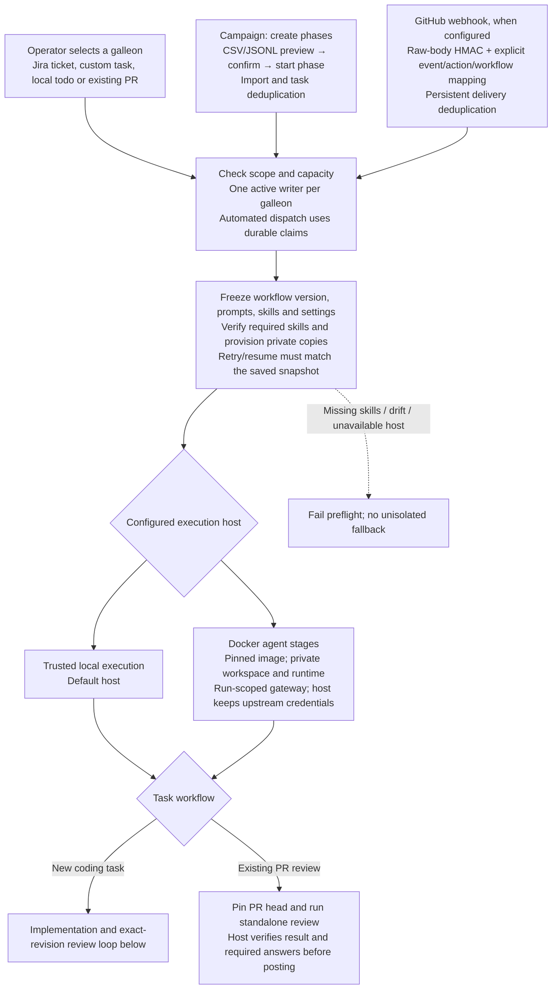
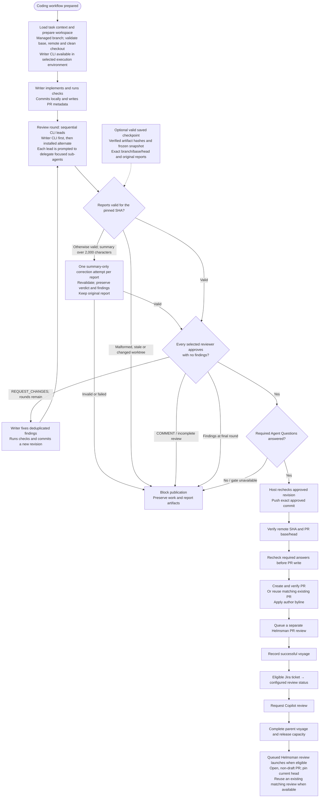
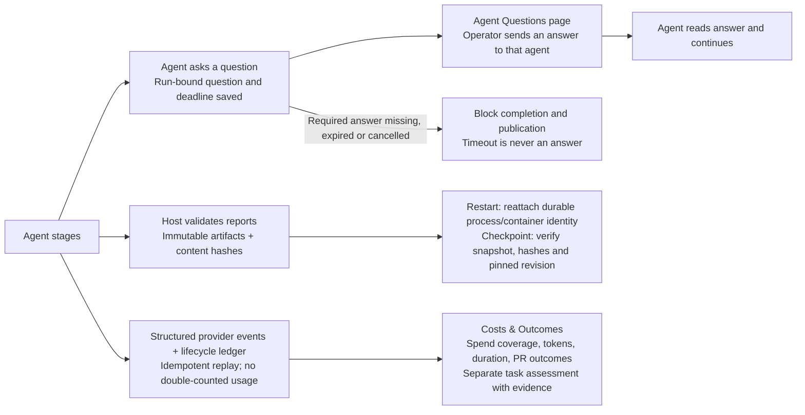

# Helmsman voyage flow

Open [helmsman-process.html](helmsman-process.html) for the standalone diagrams. They work offline and can be printed or saved as a PDF from a browser.

The flow now includes Moon Units-inspired intake, frozen execution settings, isolated agent stages, Agent Questions, durable evidence and recovery, and Costs & Outcomes. Those services surround the existing exact-revision PR review gate; they do not replace it.

## Intake and execution preparation

Manual launches inherit the header galleon unless a panel explicitly selects another. Campaign record overrides are shown in the import preview; webhook targets and workflows come only from configured mappings. Campaign phases control dispatch and concurrency; durable claims and stable run IDs allow reconciliation after uncertain launches.

In Docker mode the host supervises, verifies artifacts, and publishes; only writer/reviewer stages enter containers. Agent containers reach approved provider operations and restricted GitHub reads through a capability-scoped gateway. They receive no long-lived host credentials, unrestricted internet access, or Docker socket. Trusted local execution retains its existing host permissions.

## Coding and PR publication

## Services throughout a voyage

- **Questions:** agents ask; the operator replies. Waiting retains capacity. Required-answer checks run again immediately before publication. Contacts are optional suggested respondents, not an outbound notification system.
- **Evidence and recovery:** validated reports are recorded with immutable identities and hashes. A checkpoint continuation revalidates saved evidence before reusing it; legacy checkpoints without manifests follow an explicit compatibility path. A fresh retry preserves the original task/provider, workflow snapshot and Docker image pin; changed prompts or skills fail preflight. Restart reattachment and checkpoint continuation are different from restarting an entire failed voyage.
- **Costs and outcomes:** provider token/cost events and stage timing feed a persistent ledger. Reported spend can be partial; missing prices stay unknown. Cost-per-PR metrics use fully priced runs. Process success does not itself establish task completion: assessment state (complete/partial/failed/not-assessed) is separate from task outcome (achieved/partial/not-achieved/unknown), with supporting evidence. PR visibility is best-effort with explicit stale/unavailable status.

## Defaults and boundaries

- **Defaults:** 2 desired reviewer CLIs, 3 review rounds, 45 minutes per agent session. Configuration allows 1–2 reviewers, 1–5 rounds, and 5–180 minutes. These are defaults, not a statement of current live settings.
- The writer CLI is required in the selected execution environment. An unavailable alternate CLI permits a single reviewer, even when 2 are configured. The writer's review is a fresh session, using a detached worktree locally or an isolated review workspace in Docker.
- Reviewer leads run sequentially. Their prompts request concurrent, bounded sub-agents; the runtime does not verify that delegation happened.
- Each reviewer examines the same complete committed diff. After a fix commit, every selected reviewer reviews the new revision. A `COMMENT` verdict blocks; it does not enter the fix loop.
- Summary correction applies only to an otherwise valid report. It gets one additional session per report, with its own timeout, and does not consume another review round. The 2,000-character limit uses JavaScript string length, including whitespace and any byline.
- Preflight, agent, report, revision, and publication failures stop the flow. Pre-PR voyages have one outer attempt; the runtime does not automatically restart the entire voyage. Work is retained on failure. A push may already have occurred if a later publication check fails.
- A valid saved checkpoint skips implementation and reuses the original reports for its saved review round. It must match the current branch, base, head, and complete selected reviewer set. Oversized saved summaries can use the same correction step.
- After publication, Helmsman queues its own PR review and requests Copilot. Jira transitions apply to eligible Jira tasks, not local todos or freeform tasks. Queue and Copilot request failures do not change the successful creation voyage to failed.
- The queued Helmsman review waits for the parent to finish, available capacity, and GitHub configuration. Closed, merged, or draft PRs are blocked. A matching running or successful review for the current head can be reused. The flow does not auto-merge the PR.

## Setup and current limits

- Webhooks are disabled until a secret and explicit routes are configured; public ingress is a separate deployment choice. See [webhook setup](webhooks.md).
- Docker requires a built runtime image and host provider credentials. Dependencies/cache must be supplied in the image because agent stages have no unrestricted network access. Docker branch-update reruns currently fail preflight; the operator must select trusted local execution for that mode. See [Docker execution](docker-run-host.md).
- Offline Docker lifecycle and mocked provider gateway flows were verified during adoption. A real provider-backed Docker coding/review run still requires configured host API keys; the adoption validation did not make paid provider calls.
- No path auto-merges a PR. Merging remains a human action on GitHub.

Implementation references: `server/helmsman/prepare-run.ts`, `workflow-snapshots.ts`, `campaign-dispatcher.ts`, `webhooks.ts`, `docker-stage.ts`, `scoped-gateway.ts`, `clarification-runtime.ts`, `pre-pr-runtime.ts`, `artifacts.ts`, `run-telemetry.ts`, and `outcome-service.ts`. See [adoption evidence](moonunit-adoption.md).
